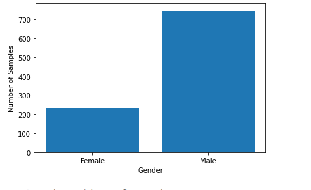
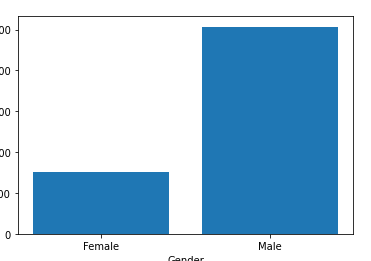
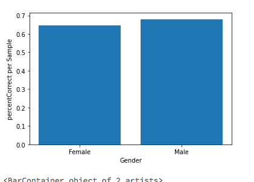

# ms-fsi-hackathon-padtservices-team

## Table of Contents
1. [Overview](#Overview)
2. [FeatureEngineering](#FeatureEngineering)
3. [Modeling](#Wireframes)
4. [Evaluation](#Schema)
5. [Next Steps](#VideoWalkthroughs)

## Overview
### Description

   Repository for Use Case 3, Machine Learning from Morgan Stanley's PADT Services team. 

## FeatureEngineering

   Observed data such as gender information to be irrelevant to actual percentage of successful trails. 
   
   

      
      
      
     

   
   Future goal is to perfrom CART Analysis using decision trees to improve clustering results and utilize more features. 
   Intial focus was to get a basic model set up to answer, the question 
   
   #### Can we determine patterns in skill acquisition which can help segment and benchmark?  and 
   #### Can we find commonalities among cases to create segments and find benchmarks based on looking at the data alone?  
  

