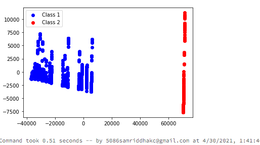

# ms-fsi-hackathon-padtservices-team

## Table of Contents
1. [Overview](#Overview)
2. [FeatureEngineering](#FeatureEngineering)
3. [Modeling](#Modeling)
4. [Evaluation](#Evaluation)
5. [NextSteps](#NextSteps)
5. [Acknowledgements](#Acknowledgements)

## Overview
### Description

   Repository for Use Case 3, Machine Learning from Morgan Stanley's PADT Services team. 
   
   As a part of the hackathon, explored answers to the following questions, 
  
   #### Can we find commonalities among cases to create segments and find benchmarks based on looking at the data alone?  
   
   and 
   
   #### Can we determine patterns in skill acquisition which can help segment and benchmark? 

## FeatureEngineering

   Observed data such as gender information to be irrelevant to actual percentage of successful trails. 
   
   

      
      
      
    

   
   Future goal is to perfrom CART Analysis using decision trees to improve clustering results and utilize more features. 
   Intial focus was to get a basic model set up to answer, the question 
   Other key feature selection tasks: 
   * [x] aggregating duration/time period to a singular numeric value
   * [x] replacing nan values with mean for continuous varible/featues like 
   * [x] replace nan value with 0 or 1 ( discrete values) for dsicrete varaibles 
   * [x] aggregations along trialIdx, sessionIdx, to simplify initial analysis.  
   * [x] one hot encoding for calssification if not already present
     

 
  

## Modeling: 

1. K-Means Clustering with clusteval to find best cluster with shielloute score. 
2. PCA to get a 2D picture of the cluster by using Dimensionality reduction 

## Evaluation 

# Choosing optimal number of clusters 
  
 
# PCA visualization for different numbers of clusters 
   
   

      
      
      
    

 
 # NextSteps
 * [x] Implement CART algoritm analysis to better understand feature importance 
 * [x] Work on intepretability and evaluation of clustering
 * [x] Try to answer the question on groupings based on goal/skill domain by framing it as a 
       supervised learning problem and utilizing random forest/decision trees.   
*  [x] Explore density based clustering methods to find other patterns in the data
*  [x] Continue working on this project outside of the hackathon 

 
# Acknowledgements
   Thanks to the fanatasic organizers and tech leads in machine learning group for answering all of my questions. 

